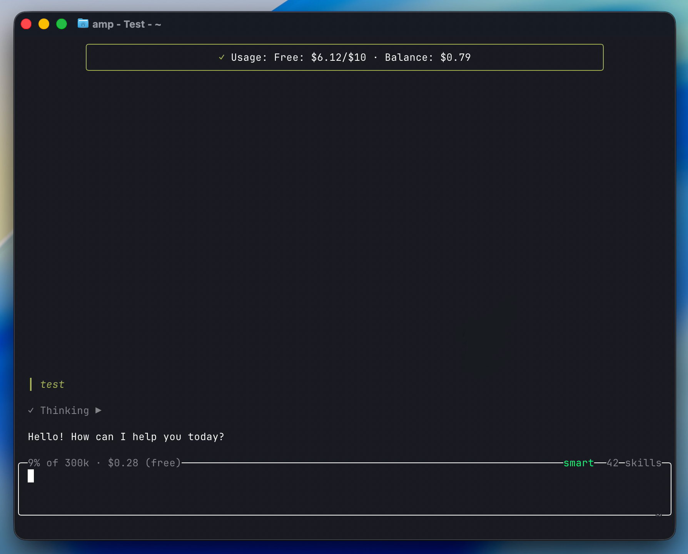

# daftAI-amp

[English](./README.md) | 中文

daftAI 分享的 [Amp](https://ampcode.com) CLI 插件，提升 Amp 使用体验。

> ⚠️ Amp 插件 API 目前为实验性质，可能会有破坏性变更。参见 [Plugin API 文档](https://ampcode.com/manual/plugin-api)。

## 可用插件

| 插件 | 描述 |
|------|------|
| [usage-monitor](plugins/daftat-usage-monitor/usage-monitor.ts) | 每次 agent 回合结束后，通知显示 Amp 使用额度（免费额度和付费余额） |

### usage-monitor

每次 agent 回合结束后，会看到类似通知：

```
Usage: Free: $6.14/$10.00 · Balance: $0.79
```



## 安装

将插件文件复制到 Amp 插件目录：

```bash
# 全局（所有项目）
cp plugins/daftat-usage-monitor/usage-monitor.ts ~/.config/amp/plugins/

# 或项目级别
cp plugins/daftat-usage-monitor/usage-monitor.ts .amp/plugins/
```

## 开始使用

启用插件运行 Amp：

```bash
PLUGINS=all amp
```

修改插件后，使用 `Ctrl-o` → `plugins: reload` 重新加载。

## 环境要求

- 通过二进制方式安装的 [Amp CLI](https://ampcode.com)（非 npm 安装）
- `amp` 命令可在 `PATH` 中找到

**注意事项：**

- 插件仅在 **Amp CLI** 中生效，不支持编辑器扩展
- 仅支持二进制安装的 Amp，不支持 `npm install` 方式

## 项目结构

```
daftAI-amp/
├── README.md             # 英文说明
├── README.zh.md          # 中文说明
├── CHANGELOG.md          # 英文变更日志
├── CHANGELOG.zh.md       # 中文变更日志
├── LICENSE
├── .gitignore
└── plugins/
    └── daftat-usage-monitor/
        └── usage-monitor.ts
```

## 贡献

欢迎提交 Issue 和 Pull Request。

## 许可证

MIT License
